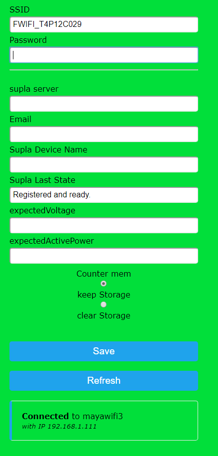

Pulse counter based on SoftVer 2.3.0. (Supla Arduino develop) By klew.

using the pulse counter channel for the energy meter and a temperature and humidity channel for voltage and wattage.

To access the Wi-Fi configuration, press button for at least 10 seconds.
in the configuration page enter the data for "suplaServer, Email and Supla Device Name (name with which it will be seen in the cloud)"

read-only field with the latest Supla connection state.

expectedVoltage -- for calibration.

expectedActivePower -- for calibration.

clear counter -- reset pulse counter.

calibration process:
connect a resistive load with a known consumption, for example a 60W bulb.
access wificonfig (button pressed 10 seconds)
in the "expectedVoltage" field set the voltage of your line for example 227.
in the "expectedActivePower" field, set the consumption of the connected load, for example 60.
press save.
The procedure takes about 15 seconds, then the device restarts and the readings will be correct.
the calibration is only executed if there are data in both fields "expectedVoltage" and "expectedActivePower"
This allows for example to change the Wi-Fi network without recalibrating.

W reading in the humidity channel will be /10
11.1 corresponds to a consumption of 111W

OTA update http://XX:81/update -- xx = device ip. for example http://192.168.1.22:81/update
user: supla
password: pass

